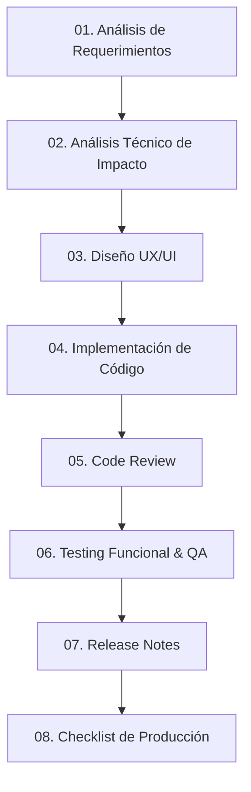

# Workflow de Desarrollo Asistido por IA (AI Prompts)

Este repositorio contiene una colección de plantillas de prompts estructuradas para guiar a asistentes o agentes de Inteligencia Artificial (como Claude, Codex, Antigravity, etc.) a lo largo de todo el ciclo de vida del desarrollo de software (SDLC).

Cada archivo está diseñado para asumir un rol de especialista y generar un entregable específico en formato Markdown (`.md`), sirviendo como puente estructurado entre requerimientos de negocio y despliegue en producción.

---

## 📋 Flujo de Trabajo (SDLC)

El proceso sigue una secuencia lógica de 8 pasos, desde la concepción de la idea hasta la verificación de producción:

---

## 🛠️ Detalle de los Prompts

A continuación se describen las plantillas disponibles en este repositorio:

### 1. [01-requirement-codex.md](./01-requirement-codex.md)
* **Rol:** Product Owner Técnico / Arquitecto de Software Senior.
* **Objetivo:** Analizar una nueva funcionalidad o requerimiento y generar la documentación inicial.
* **Entregables:** Resumen funcional, casos de uso/borde, riesgos, dependencias y un plan de trabajo guardado en un archivo Markdown.

### 2. [02-analysis-claude.md](./02-analysis-claude.md)
* **Rol:** Arquitecto Full Stack Senior.
* **Objetivo:** Analizar el estado actual del repositorio **sin modificar archivos** para evaluar el impacto técnico de la funcionalidad deseada.
* **Entregables:** Diagnóstico de la arquitectura actual, flujo de datos, archivos a modificar/crear, riesgos de implementación y plan detallado.

### 3. [03-ui-antigravity.md](./03-ui-antigravity.md)
* **Rol:** Diseñador UX Senior / QA Funcional.
* **Objetivo:** Definir la experiencia de usuario y el comportamiento visual antes de iniciar la programación.
* **Entregables:** Flujo de usuario, wireframes conceptuales, estados de interfaz (cargas, errores, vacíos), adaptabilidad y accesibilidad.

### 4. [04-implementation-claude.md](./04-implementation-claude.md)
* **Rol:** Desarrollador Full Stack Senior.
* **Objetivo:** Escribir e implementar los cambios de código siguiendo reglas estrictas de desarrollo limpio.
* **Entregables:** Plan técnico, código implementado (sin comentarios innecesarios, tipado estricto y en inglés) y resumen de cambios.

### 5. [05-review-codex.md](./05-review-codex.md)
* **Rol:** Tech Lead Senior.
* **Objetivo:** Realizar una revisión exhaustiva del código implementado en búsqueda de mejoras y riesgos.
* **Entregables:** Detección de bugs, problemas de rendimiento/seguridad, violaciones de principios SOLID y veredicto final (aprobación o solicitud de cambios).

### 6. [06-testing-antigravity.md](./06-testing-antigravity.md)
* **Rol:** QA Senior.
* **Objetivo:** Validar funcionalmente los cambios mediante pruebas integrales.
* **Entregables:** Pruebas del camino feliz (happy path), casos negativos, comportamiento responsive, severidad de fallos y recomendación final.

### 7. [07-release-notes.md](./07-release-notes.md)
* **Rol:** Release Manager Senior.
* **Objetivo:** Resumir el impacto y los cambios de la entrega para el equipo técnico y stakeholders.
* **Entregables:** Un archivo de notas de lanzamiento detallando nuevas funcionalidades, mejoras, correcciones de errores e impacto operativo.

### 8. [08-production-checklist.md](./08-production-checklist.md)
* **Rol:** DevOps Lead / Tech Lead Senior.
* **Objetivo:** Asegurar que se cumplan todas las validaciones críticas antes de realizar la publicación.
* **Entregables:** Lista de verificación de variables de entorno, migraciones, rendimiento frontend, seguridad y planes de rollback (marcha atrás).

---

## 🚀 Cómo Utilizar estas Plantillas

1. **Selecciona la plantilla** correspondiente a la etapa actual de tu desarrollo.
2. **Reemplaza los parámetros dinámicos** del archivo, por ejemplo:
   * `{{FEATURE}}`: Descripción de la funcionalidad.
   * `{{INPUT_PATH}}` / `{{INPUT_PATH_1}}`: Rutas a los archivos fuente o de análisis anteriores.
   * `{{OUTPUT_PATH}}`: Ruta donde el agente debe guardar su reporte Markdown.
3. **Pasa el prompt al asistente de IA** en tu entorno de desarrollo para ejecutar la tarea.
